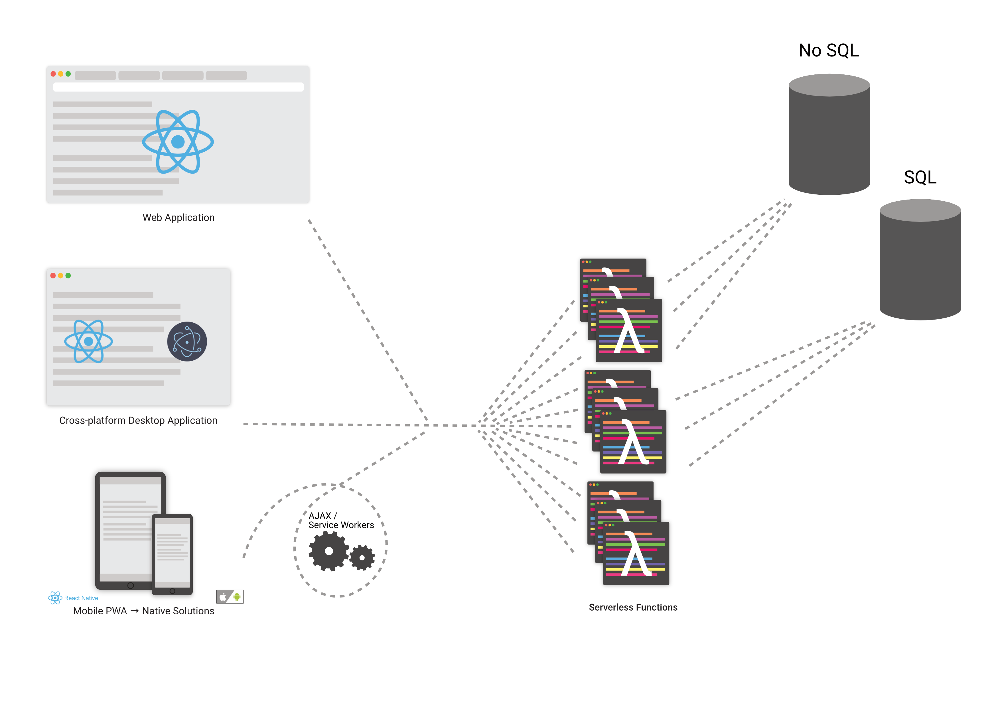

## Microservices Example
This monorepo example houses a React application and two microservices in charge of `POST` and `GET` operations to interface with individual collections and/or tables. Rather than having a monolithic server listen for requests, Now spins up Lambas on a per-request basis, eliminating  the financial overhead of continuously running a server, and eliminating labor costs of maintaining, monitoring, and upgrading server infrastructure.

The application (an empty React app) is running at https://monorepo.jefferydreynolds.now.sh
`GET`s or `POST`s can be made to https://monorepo.jefferydreynolds.now.sh/api/resource1 or 
https://monorepo.jefferydreynolds.now.sh/api/resource2.

## Microservice Architecture
Now is programmed to serve the built index.js file in `api/<microservice-name>/dist/`. Make your changes to each microservice
in `api/<microservice-name>/src/`, rebuild the microservice with `npm run build` from the TypeScript source when done.

## Development Mode
`now dev` from the root of the project directory will run the entire monorepo.

## Deployment
After making changes either to the client or microservice(s), `now`'s diffing capabilities can be leveraged to only deploy the service(s) that have changed. From the root
of the application, run `now deploy`

## Stack
- Now - Lambdas, Serverless deployment
- React w/ Typescript
- Express Routing (per microservice)
